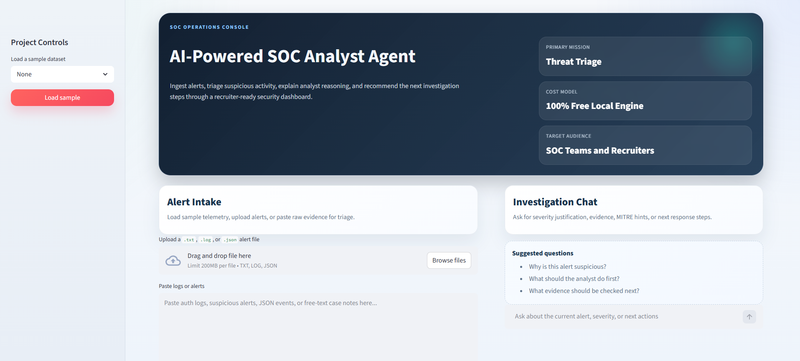
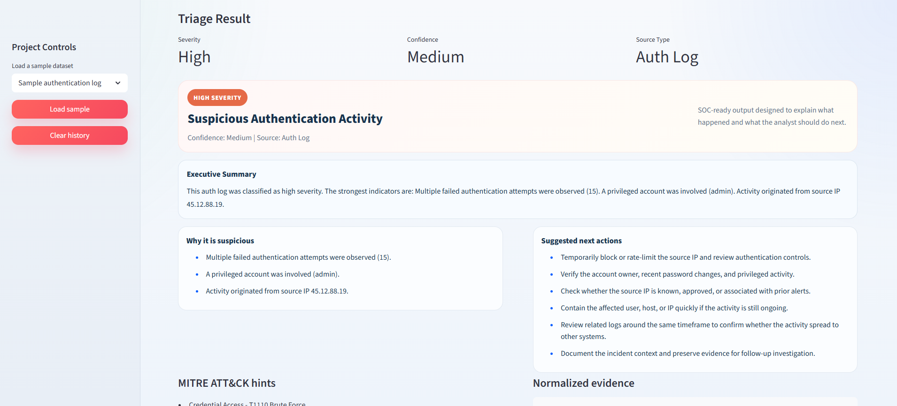
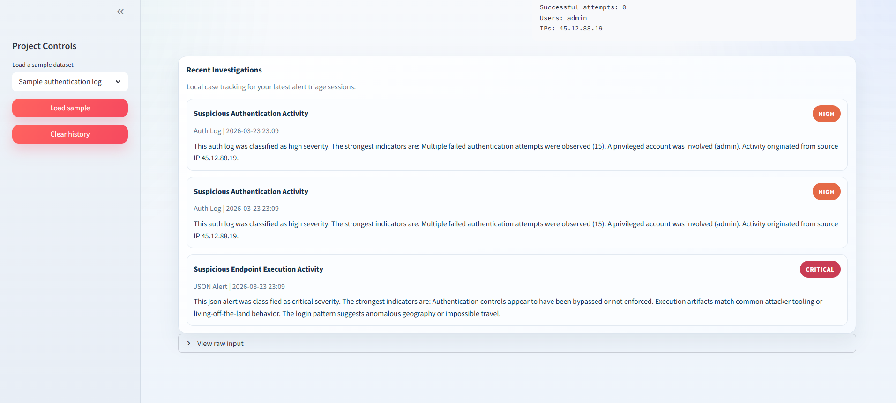

# AI-Powered SOC Analyst Agent

AI-Powered SOC Analyst Agent is a Streamlit-based cybersecurity dashboard that simulates how a SOC analyst triages alerts, explains suspicious activity, classifies incident severity, maps behavior to MITRE ATT&CK, and recommends the next response steps.

This project is fully free to run, works with a local rule-based engine, and is designed to be strong for internships, portfolio demos, and early-career cybersecurity interviews.

## Dashboard Preview





## Why this project stands out

- Combines AI, cybersecurity, SOC workflow thinking, and automation in one portfolio-ready build.
- Demonstrates practical alert triage instead of a generic chatbot demo.
- Supports realistic analyst tasks: log intake, suspicious behavior explanation, severity classification, and response recommendations.
- Includes sample datasets so the project is demo-ready even before connecting real telemetry.
- Runs without any paid API, cloud account, or external model dependency.

## MVP features

- Analyze pasted logs, uploaded files, JSON alerts, and authentication logs
- Classify alert severity as Low, Medium, High, or Critical
- Explain why the activity appears suspicious
- Suggest concrete incident response actions
- Provide an investigation chat panel for follow-up questions
- Use a free local rule-based engine for alert analysis and investigation guidance
- Tune severity more realistically across brute-force, identity, endpoint, and exfiltration scenarios
- Map alerts to MITRE ATT&CK techniques using free local rules
- Track recent investigations directly in the dashboard

## Key capabilities

- SOC-style alert triage with structured explanations
- Severity scoring for suspicious authentication, endpoint, identity, and exfiltration scenarios
- MITRE ATT&CK mapping using local detection rules
- Recent investigations panel for lightweight case tracking
- Free offline-friendly workflow with no paid API dependency

## Project structure

```text
AI-Powered-SOC-Analyst-Agent/
|-- app.py
|-- requirements.txt
|-- data/
|   |-- sample_alerts.json
|   |-- sample_auth_logs.txt
|-- src/
|   |-- agent.py
|   |-- models.py
|   |-- parsers.py
```

## Tech stack

- Python
- Streamlit
- Local heuristic SOC analysis engine

## Quick start

1. Create a virtual environment.
2. Install dependencies:

```bash
pip install -r requirements.txt
```

3. Start the app:

```bash
streamlit run app.py
```

## Demo ideas

- Load the bundled authentication log and explain a brute-force login attempt.
- Upload a JSON alert file and ask the chat panel to justify the severity score.
- Replace the sample data with your own NIDS, EDR, or SIEM-style alert exports.
- Demonstrate that the project works completely offline without paid AI services.
- Showcase recent investigation history and MITRE mapping during your demo.

## Suggested next roadmap

### Phase 1

- Improve alert normalization for multiple log sources
- Add richer case summaries and investigation notes
- Polish the UI for portfolio screenshots

### Phase 2

- Add stronger MITRE ATT&CK mapping
- Integrate NIDS or SIEM outputs
- Support real-time alert ingestion
- Add case history and analyst feedback loops
- Add an optional local LLM later if you want deeper free-text reasoning

## Resume title

**AI-Powered SOC Analyst Agent for Automated Threat Detection and Incident Response**
